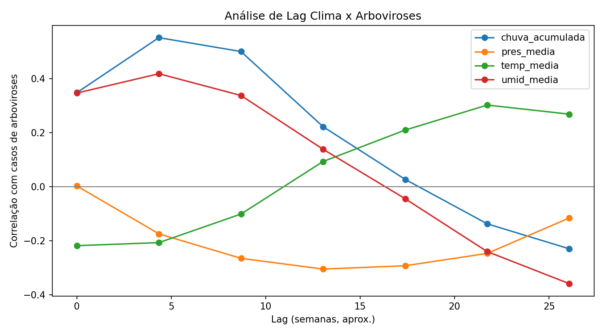
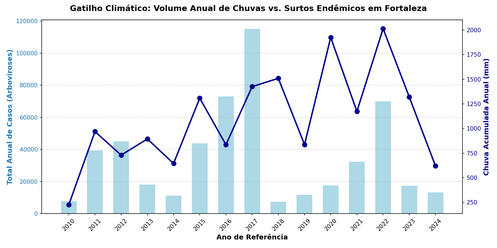

# Análise Preditiva de Endemias: O Impacto do Clima e Saneamento nas Arboviroses em Fortaleza (2010 - 2024)

Este repositório contém o pipeline de Engenharia de Dados (ETL) e Ciência de Dados desenvolvido para investigar as correlações estatísticas entre gatilhos climáticos, infraestrutura de saneamento básico e o histórico de notificações de arboviroses (como a Dengue) na cidade de Fortaleza - CE.

O objetivo central deste estudo é a análise de dados ambientais (como umidade, pressão, temperatura e chuva) e de saneamento básico como fatores para a ocorrência de arboviroses em Fortaleza-CE. Buscamos compreender o verdadeiro impacto que esses fatores possuem nos casos endêmicos da cidade e, a partir disso, indicar possíveis medidas preventivas contra a explosão de contágios.

## 🎯 O Problema e a Solução
A gestão tradicional de epidemias atua de forma reativa, lidando com a superlotação de hospitais após a explosão de casos. Através da análise de mais de uma década de dados abertos governamentais, este protótipo analítico **evidencia matematicamente** que surtos epidêmicos são eventos multifatoriais e predizíveis.

**Identificamos** a existência de uma defasagem temporal (*Lag Analysis*) de aproximadamente 4 semanas entre os gatilhos climáticos e as notificações de saúde. Isso oferece aos gestores uma "janela de oportunidade" de um mês para agir com medidas profiláticas antes do agravamento da crise endêmica.

## 🛠️ Tecnologias e Ferramentas
O projeto foi construído utilizando um ecossistema Python voltado para análise de dados:

* **Linguagem:** Python 3
* **Manipulação e ETL:** Pandas, NumPy
* **Visualização de Dados:** Matplotlib, Seaborn
* **Coleta e Extração de Dados:** Consumo de API REST (InfoDengue) e processamento de arquivos estáticos estruturados em .csv (INMET e Trata Brasil)
* **Gestão de Versão:** Git e GitHub

## 📊 Fontes de Dados (Open Data)
A consolidação da matriz de análise utilizou as seguintes fontes governamentais abertas:

* **InfoDengue (Fundação Oswaldo Cruz):** Histórico de notificações de casos de arboviroses.
* **INMET (Instituto Nacional de Meteorologia):** Dados climáticos históricos (chuva acumulada, temperatura, umidade).
* **SNIS / Painel Saneamento Brasil:** Índices anuais de déficit de esgotamento sanitário.

## 💡 Principais Descobertas (Data Storytelling)
A modelagem estatística gerou três grandes *insights* que **sustentam** a tese do projeto:

* **A Janela Preditiva de 4 Semanas:** A correlação de Pearson alinhada à *Lag Analysis* indicou que os picos de umidade e chuva precedem o aumento de internações em aproximadamente um mês, tempo hábil para intervenção com larvicidas.
* **Saneamento como "Pólvora" (Vulnerabilidade Base):** A análise cruzada demonstrou que a alta taxa de população sem coleta de esgoto cria o ambiente propício (criadouros artificiais) para a proliferação do vetor.
* **O Clima como "Fósforo" (Gatilho):** A análise multifatorial ajudou a explicar anomalias históricas da base de dados. Em 2014, apesar do déficit de saneamento alarmante (> 50%), a incidência de dengue foi muito baixa devido à seca severa que atingiu o Ceará, **sugerindo fortemente** que o vetor depende da umidade para engatilhar a epidemia.






## 🚀 Como Executar o Projeto Localmente
Siga as instruções abaixo para reproduzir a análise de dados no seu ambiente local:

1. Clone este repositório: 
```bash
git clone [https://github.com/clay1442/observatorio-saude-urbana.git](https://github.com/clay1442/observatorio-saude-urbana.git)
````
2. Acesse a pasta do projeto:
```bash
cd observatorio-saude-urbana
````
3. Instale o ambiente virtual (venv):
```bash
python -m venv venv
````
4. Instale as dependências necessárias:
```bash
pip install -r requirements.txt
````
5 Execute os scripts de análise estrutural:
```bash
python climate_health_analysis.py
````
## 👥 Equipe de Desenvolvimento

A construção deste protótipo analítico contou com a atuação conjunta de toda a equipe no núcleo duro do projeto: **Engenharia de Dados (ETL), Modelagem Estatística e Análise Visual das Correlações**. 

Abaixo, destacam-se os focos de atuação específicos e as entregas individuais de cada integrante:

* **Clay José Ribeiro Soares** [](https://www.linkedin.com/in/clayjose)
  * **Atuação Específica:** Formalização da base climática (INMET), arquitetura de integração (*Merge*) dos três *DataFrames* e estruturação da Documentação Acadêmica.

* **Antônio Marcos Vieira Silva** [](https://www.linkedin.com/in/dev-marcos-silva)
  * **Atuação Específica:** Formalização dos indicadores de Saneamento Básico, padronização global das colunas/matrizes e estruturação da Documentação Acadêmica.

* **Fábio Mateus da Silva Josino Pereira** [](https://www.linkedin.com/in/fbomateus)
  * **Atuação Específica:** Desenvolvimento da lógica em Python para geração das visualizações de dados e tratamento da base epidemiológica (InfoDengue).

<br>

> **Nota:** Projeto desenvolvido como componente de Extensão Universitária. Formando tecnologia direcionada ao impacto sociocomunitário e salvaguarda da saúde pública.
